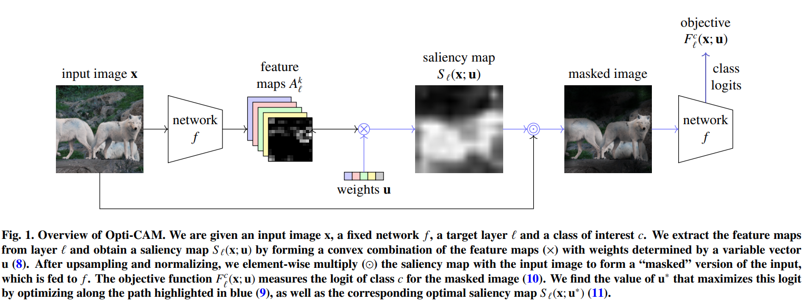

# OptiCAM
code for the CVIU paper: "[Opti-CAM: Optimizing saliency maps for interpretability](https://www.sciencedirect.com/science/article/pii/S1077314224001826?via%3Dihub)"


______
### Install
Please install the package [pytorch-grad-cam](https://github.com/jacobgil/pytorch-grad-cam)

__________
The demo can be run by
```
./demo.sh
```
or
```
python generate_opticam.py
```
